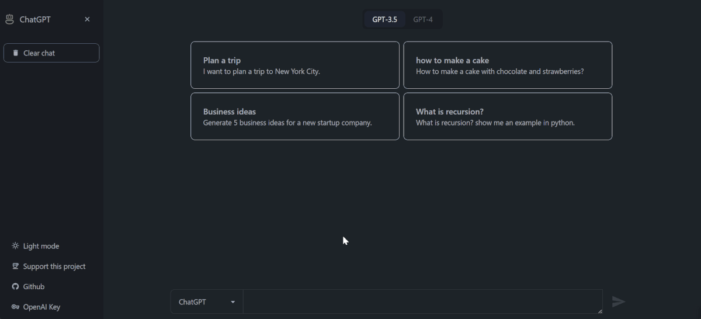

# Coding Assistant

Coding Assistant is a personal AI chatbot that will help you in your programming journey

## One-Click Deploy

<!--
### Deploy to Netlify

[](https://app.netlify.com/start/deploy?repository=https://github.com/EyuCoder/chatgpt-clone)

### Deploy to Vercel

[](https://vercel.com/new/clone?repository-url=https://github.com/EyuCoder/chatgpt-clone&project-name=chatgpt-and-dalle&repo-name=chatgpt-clone) -->

_you can checkout the app [here](https://chatgpt.eyucoder.com/)_

> a demo of the App

https://user-images.githubusercontent.com/26358650/212903093-08c58f9b-25b5-440d-89e7-7a4b1f36df5a.mp4


### Features

- [x] gpt 3.5 and 4
- [x] dall.e image generator
- [x] save chat to localstorage
- [x] chat context

## install

```bash
npm install
```

## start app

```bash
npm run dev
```

**_Tech used_**

- openai API
- Langchain
- React with Vite
- TailwindCSS with DaisyUI
- react-icons
- react-markdown
